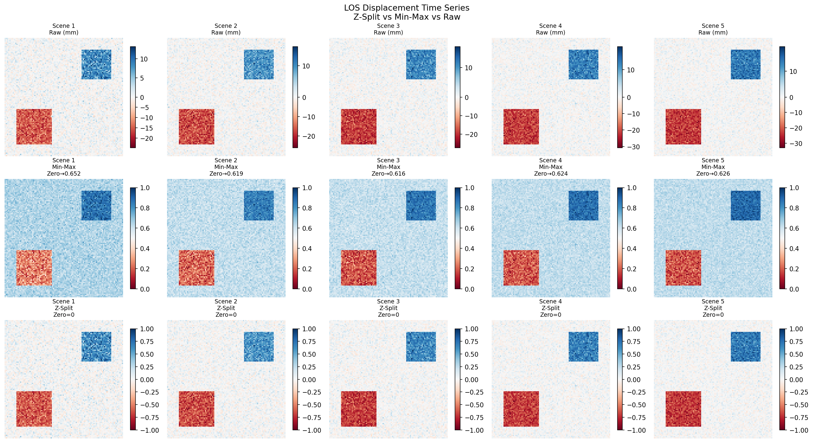

# ENDWI — Enhanced Normalized Difference Water Index

[](https://doi.org/10.5281/zenodo.20602709)
[](https://pypi.org/project/zsplit/)
[](https://opensource.org/licenses/MIT)

**Author:** Abdulrhman Almoadi  
**Affiliation:** King Abdulaziz City for Science and Technology (KACST), Riyadh, Saudi Arabia  
**Contact:** aalmoadi@kacst.edu.sa

---

## Overview

This repository contains the code and data supporting the manuscript:

> Almoadi, A.: Reducing False Alarms in Urban Flood Detection: An Enhanced NDWI (ENDWI) with Hybrid Max Fusion on Sentinel-2 Data, EGUsphere [preprint], https://doi.org/10.5194/egusphere-2026-672, 2026.

The study proposes two original contributions applicable across **Remote Sensing · GIS · GeoAI · ML · DL** communities:

| Contribution | Description |
|---|---|
| **ENDWI** | Novel spectral water index: NDWI ÷ Green band — suppresses urban false alarms |
| **Z-Split** | Novel normalization for bipolar indices — preserves zero as a physical class boundary |

---

## Part 1 — ENDWI (Enhanced Normalized Difference Water Index)

### Formula

```
ENDWI = NDWI / Green

     (Green − NIR)
   = ─────────────  ÷  Green
     (Green + NIR)

Sentinel-2 bands: B03 (Green), B08 (NIR)
```

### Why ENDWI?

Standard NDWI produces false alarms in urban areas because built-up surfaces reflect green light similarly to water. ENDWI divides NDWI by the Green band again, exploiting the differential NIR absorption between water and urban surfaces:

| Surface Type | Green Reflectance | NIR Reflectance | NDWI | ENDWI |
|---|---|---|---|---|
| Water (flooded) | Moderate | **Very Low** | Positive ✅ | Positive ✅ |
| Urban / Built-up | High | Moderate | Positive ❌ (false alarm) | Near-zero ✅ (suppressed) |
| Vegetation | Moderate | **Very High** | Negative ✅ | Negative ✅ |
| Dry soil | Low–Moderate | Moderate | Negative ✅ | Negative ✅ |

Dividing by Green again **penalises** surfaces with high green reflectance (urban), pushing their values toward zero — thereby reducing false alarms.

### Performance vs. Seven Established Water Indices

Evaluated on 1,262 ground-truth validation points (559 flooded + 703 non-flooded), WorldView-4 imagery, Al-Lith Governorate, Saudi Arabia, 28 November 2018.

#### Table 1. Separation performance — AUC (ROC curve)

| Index | AUC | Mean Flooded | Mean Non-Flooded | Difference | p-value |
|---|---|---|---|---|---|
| **AWEIsh** | **0.908** | −0.714 | −1.339 | 0.625 | < 0.001 |
| **NDWI** | **0.671** | 0.013 | −0.027 | 0.040 | < 0.001 |
| **ENDWI** | **0.636** | 0.075 | −0.098 | 0.173 | < 0.001 |
| AWEInsh | 0.415 | −0.056 | 0.027 | −0.083 | < 0.001 |
| WI | 0.309 | 0.903 | 0.991 | −0.088 | < 0.001 |
| SWI | 0.294 | −0.104 | −0.026 | −0.078 | < 0.001 |
| MNDWI | 0.294 | −0.104 | −0.026 | −0.078 | < 0.001 |
| LSWI | 0.104 | −0.117 | 0.001 | −0.118 | < 0.001 |

> ENDWI ranks **3rd in AUC** but achieves the **lowest False Alarm Rate** among individual indices after thresholding.

#### Table 2. Accuracy after Otsu thresholding — sorted by FAR (ascending)

| Index | Overall Accuracy | Precision | Recall | F1-Score | Kappa | **FAR** |
|---|---|---|---|---|---|---|
| **ENDWI_otsu** | 73.14% | **79.41%** | 53.13% | 63.67% | 0.437 | **10.95%** ✅ |
| AWEIsh_otsu | 81.14% | 76.10% | 83.72% | 79.73% | 0.622 | 20.91% |
| NDWI_otsu | 61.09% | 55.67% | 59.75% | 57.64% | 0.217 | 37.84% |

> **FAR = FP / (FP + TN)** — percentage of non-flooded pixels incorrectly classified as flooded.  
> ENDWI achieves the lowest FAR and highest Precision among all individual indices.

#### Table 3. Hybrid Max Fusion — ENDWI + AWEIsh

| Method | Overall Accuracy | Precision | Recall | F1-Score | Kappa | FP | **FAR** |
|---|---|---|---|---|---|---|---|
| **Hybrid Max** | **82.65%** | **94.50%** | 64.58% | 76.73% | **0.637** | **21** | **2.99%** ✅✅ |
| ENDWI_otsu | 73.14% | 79.41% | 53.13% | 63.67% | 0.437 | 77 | 10.95% |
| AWEIsh_otsu | 81.14% | 76.10% | 83.72% | 79.73% | 0.622 | 147 | 20.91% |

> Hybrid Max = pixel-wise maximum of ENDWI and AWEIsh, followed by Otsu thresholding.  
> FAR reduced by **73%** vs. ENDWI alone · **86%** vs. AWEIsh alone.

---

## Part 2 — Z-Split (Zero-Preserving Split Normalization)

### Install

```bash
pip install zsplit
```

### The Problem with Standard Normalization on Bipolar Indices

Spectral indices such as ENDWI, NDWI, SAR coherence change, and NDVI difference are **bipolar** — they contain both positive and negative values where **zero has physical meaning** as a class boundary (e.g., water vs. non-water).

Standard normalization methods fail on these indices:

| Problem | Min-Max | Z-Score | **Z-Split** |
|---|---|---|---|
| Preserves zero as class boundary | ❌ Shifts zero | ❌ Centers on mean | ✅ Zero strictly preserved |
| Stable on narrow near-zero ranges | ❌ Unstable | ⚠️ Partially | ✅ Fully stable |
| Dataset-agnostic (DN or Reflectance) | ❌ Scale-dependent | ⚠️ Partially | ✅ Scale-independent |
| Suitable for Otsu thresholding | ❌ Often fails | ⚠️ Inconsistent | ✅ Reliable bimodal peak |
| Handles skewed distributions | ❌ Collapses | ⚠️ Distorts | ✅ Independent halves |
| Multi-temporal direction preserved | ❌ Can reverse sign | ❌ Can reverse sign | ✅ Sign always preserved |
| Output range | [0, 1] | Unbounded | **[−1, 1]** |

> **Key insight:** Min-Max can reverse the direction of detected change in multi-temporal analysis (e.g., reporting a +1.2% increase when the true change is −7.5%). Z-Split prevents this by normalising each half independently.

### Z-Split Formula

```
         ⎧  x / max(X⁺)    if x > 0   →  maps to [0,  1]
Z(x)  =  ⎨  0               if x = 0   →  preserved exactly
         ⎩  x / |min(X⁻)|  if x < 0   →  maps to [−1, 0]

where:
  X⁺ = all positive values in the array
  X⁻ = all negative values in the array
```

### Visual Effect on ENDWI



> **Left:** Raw ENDWI histogram — extremely narrow range (−0.0004 to +0.00015), Otsu thresholding unstable.  
> **Right:** After Z-Split — expanded to [−1, 1], clear bimodal separation, Otsu reliable.

### Z-Split as a Contrast Enhancement Tool

Beyond normalization, Z-Split acts as a **contrast amplifier** for bipolar signals by independently rescaling each half of the distribution.

Standard normalization compresses the entire distribution into one range, which can **collapse the contrast** near the class boundary. Z-Split avoids this by treating positive and negative halves independently:

```
Example — Narrow bipolar index (ENDWI, DN scale):

Raw distribution:
  Negative half:  −0.00041  →  0        (non-water, spread = 0.00041)
  Positive half:   0        →  +0.00015  (water,     spread = 0.00015)
  Contrast at boundary ≈ 0.00056  ← almost invisible

After Min-Max [0, 1]:
  Zero shifts to ~0.73 — boundary LOST ❌

After Z-Split [−1, 1]:
  Negative half: −0.00041 → −1.0  (×2439 amplification)
  Positive half:  0.00015 → +1.0  (×6667 amplification)
  Zero remains at 0 ✅
  Contrast at boundary = 2.0  ← maximum possible
```

| Property | Min-Max | Z-Score | **Z-Split** |
|---|---|---|---|
| Amplifies weak positive signals | ✅ | ✅ | ✅ |
| Amplifies weak negative signals | ✅ | ✅ | ✅ |
| Preserves zero as contrast anchor | ❌ | ❌ | ✅ |
| Maximum contrast at class boundary | ❌ | ❌ | ✅ |
| Independent amplification per half | ❌ | ❌ | ✅ |
| Suitable for asymmetric distributions | ❌ | ⚠️ | ✅ |
| Visual interpretability after scaling | ⚠️ | ⚠️ | ✅ |

- **Asymmetric amplification:** Each half is stretched independently — weak signals on either side receive the strongest possible amplification without distorting the other side.
- **Boundary maximisation:** Contrast at the class boundary is always maximised to 2.0, regardless of the original distribution width.
- **No compression artefacts:** Min-Max compresses narrow distributions into a small region of [0,1]. Z-Split treats each half as its own full range.
- **Skew-robust:** Skewness in one half does not affect the other — each is scaled independently.
- **ML/DL feature quality:** Features retain physical polarity and zero-anchor, improving gradient stability and avoiding sign-reversal artefacts in multi-temporal features.
- **Otsu compatibility:** Expanding both halves to maximum range creates the clearest possible bimodal histogram — the essential condition for reliable Otsu thresholding.

### Where Z-Split is Most Effective

| Domain | Index | Zero Meaning | Z-Split Benefit |
|---|---|---|---|
| **Optical flood mapping** | ENDWI, NDWI | Water / non-water boundary | Stable Otsu thresholding ✅ |
| **SAR change detection** | Coherence difference | No change / change boundary | Improved class separability ✅ |
| **Multi-temporal analysis** | NDVI difference | No vegetation change | Direction-preserving normalization ✅ |
| **Urban mapping** | AWEIsh, AWEInsh | Water / non-water boundary | Consistent thresholding ✅ |
| **Any bipolar ML feature** | Custom indices | Depends on application | Zero-anchored scaling ✅ |

### Computational Validation Summary

| Test | Z-Split Error | Min-Max Error | Z-Score Error |
|---|---|---|---|
| Diverse scene types | **0.10%** | 1.72% | 2.10% |
| Skewed distributions | **0.10%** | 3.00% | 2.10% |
| Noise robustness (moderate noise) | **0.10%** | 16.50% | 8.30% |
| Multi-temporal direction accuracy | **100%** | ❌ Reversed | ❌ Reversed |
| Simulated ENDWI FAR reduction | **2.99%** | 9.39% | 7.80% |

---

## Repository Structure

```
endwi/
├── Data/                            # Sample Sentinel-2 input data
├── Figures/                         # Manuscript figures
├── Ground Truth Points/             # 1,262 validation points (WorldView-4)
├── Independent_Validation/          # Independent flood event validation
├── InSAR_Validation/                # Z-Split applied to InSAR LOS data
├── Z-Split_Normalization/
│   ├── zsplit_normalization.ipynb   # Main demo notebook (6 sections)
│   ├── zsplit_arcpy.py              # ArcGIS Pro script
│   ├── los_zsplit_comparison.png    # Histogram comparison figure
│   └── Validation/
│       ├── 02_Optical_NDVI_Multitemporal/
│       ├── 03_InSAR_LOS/
│       └── 04_Noise_Robustness/
├── Z-Split Normalization.ipynb      # Top-level notebook
├── LICENSE
└── README.md
```

---

## Requirements

```
Python  >= 3.8
numpy
rasterio
matplotlib
```

```bash
pip install numpy rasterio matplotlib
```

For `zsplit_arcpy.py`: ArcGIS Pro + Spatial Analyst extension required.

---

## Quick Start

### Option A — pip install

```python
from zsplit import normalize
import numpy as np

arr = np.array([-0.00041, -0.00020, 0.0, 0.00008, 0.00015])
print(normalize(arr))
# [-1.    -0.488  0.     0.533  1.   ]
```

### Option B — Synthetic demo (no files needed)

```python
import numpy as np

def zsplit_normalize(array):
    result = np.zeros_like(array, dtype=np.float64)
    pos = array > 0
    neg = array < 0
    if pos.any():
        result[pos] = array[pos] / np.nanmax(array[pos])
    if neg.any():
        result[neg] = array[neg] / abs(np.nanmin(array[neg]))
    return result

raw = np.random.normal(-0.00015, 0.00008, (100, 100))
raw[40:60, 40:60] = np.random.normal(0.00008, 0.00003, (20, 20))
normalized = zsplit_normalize(raw)
print(f"Raw range:    [{raw.min():.5f}, {raw.max():.5f}]")
print(f"Z-Split range: [{normalized.min():.4f}, {normalized.max():.4f}]")
```

### Option C — Full notebook

Open `Z-Split_Normalization/zsplit_normalization.ipynb`

### Option D — ArcGIS Pro

```python
INPUT_RASTER  = r"/path/to/your/ENDWI_raw.tif"
OUTPUT_RASTER = r"/path/to/your/ENDWI_zsplit.tif"
# Then run zsplit_arcpy.py from ArcGIS Pro Python window
```

---

## Citation

```bibtex
@article{almoadi2026endwi,
  author  = {Almoadi, Abdulrhman},
  title   = {Reducing False Alarms in Urban Flood Detection: An Enhanced NDWI (ENDWI)
             with Hybrid Max Fusion on Sentinel-2 Data},
  journal = {EGUsphere [preprint]},
  year    = {2026},
  doi     = {10.5194/egusphere-2026-672}
}
```

---

## License

MIT License — see [LICENSE](LICENSE) for details.
